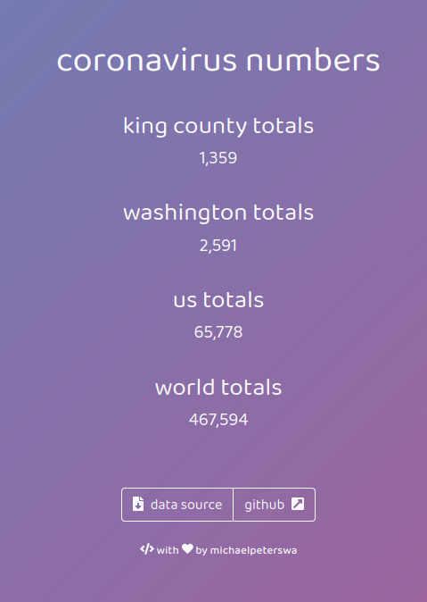

# coronavirus-tracker
a coronavirus tracker tool written in Node.Js
>

## Installation
```
git clone https://github.com/michaelpeterswa/coronavirus-tracker.git
```
Or download the file manually.
## Release History
* 0.0.1
   * Opened Repository (03.25.2020)
## Meta
Michael Peters - *enter additional contact information here*

Distributed under the ____ license. See ``LICENSE`` for more information.
